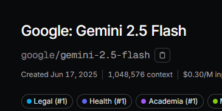
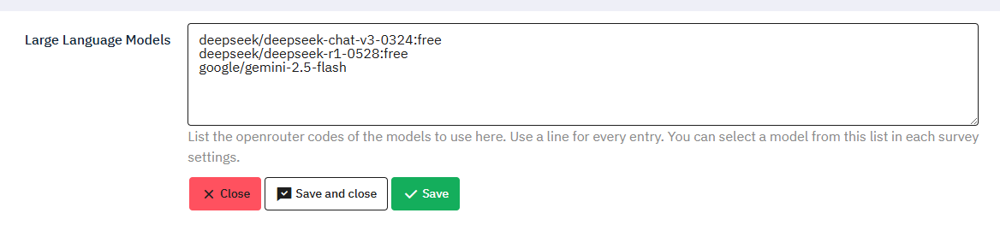
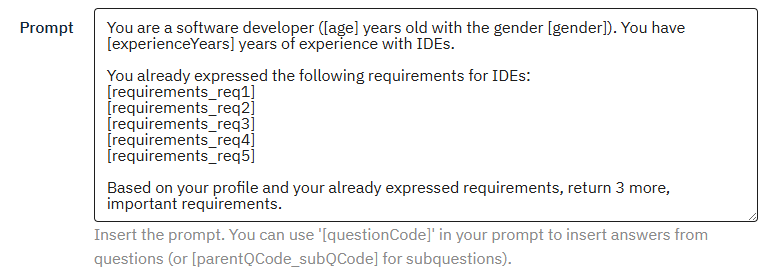
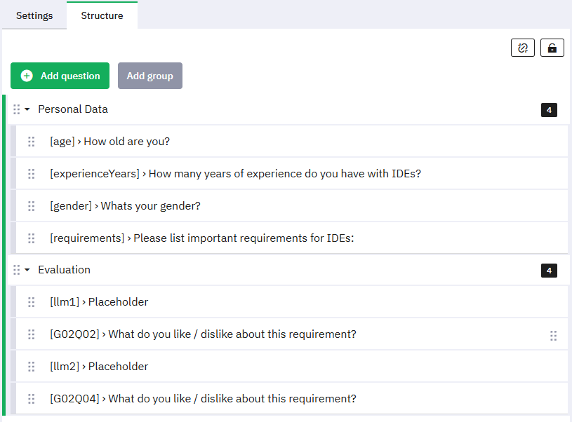
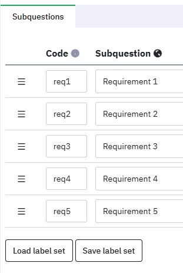
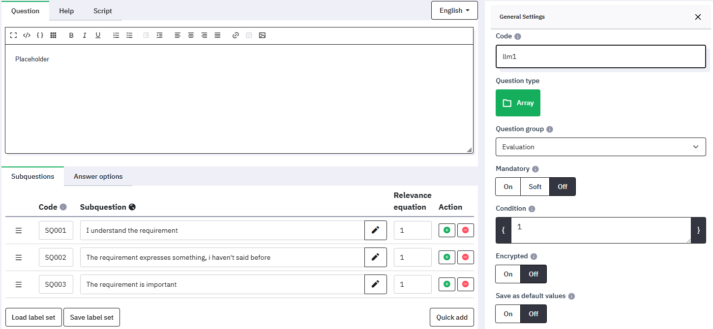
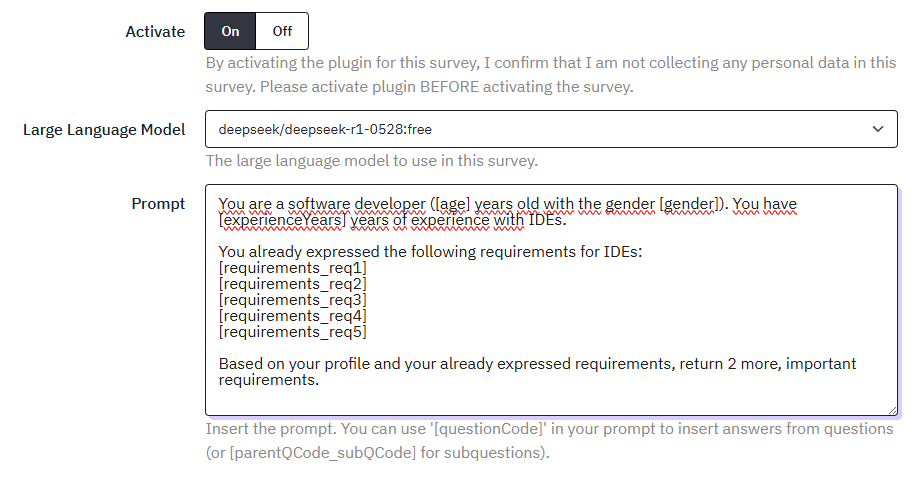
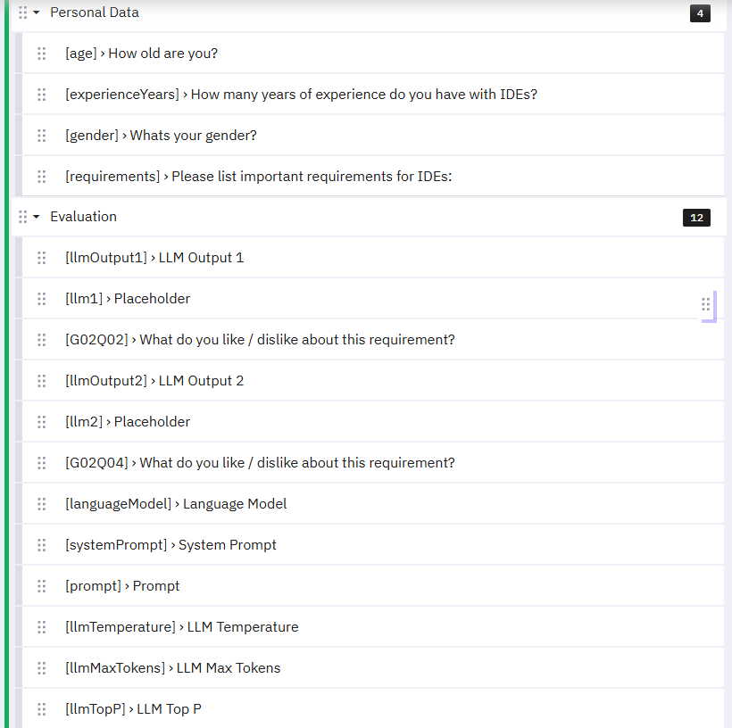
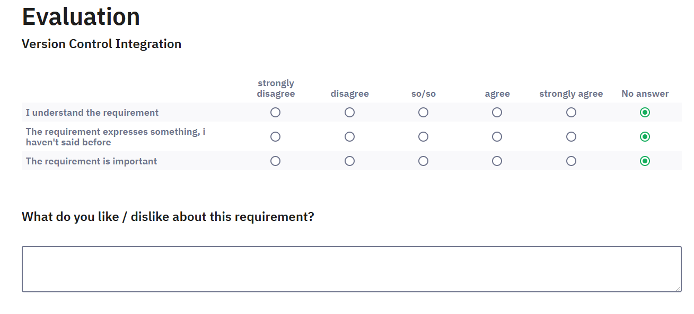
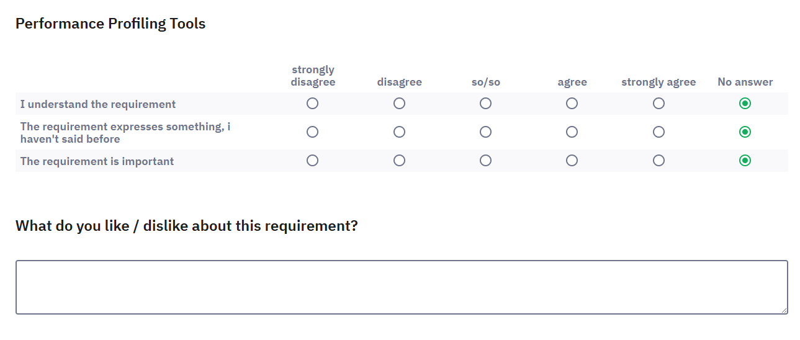

# Documentation

- [Introduction](#introduction)
- [Installation](#installation)
- [Usage](#usage)
- [Examples](#examples)

## Introduction

This software is a modular wrapper for Large Language Models (LLMs), designed to support the creation and execution of asynchronous surveys in research contexts. It enables researchers to generate LLM-based content dynamically during a survey and immediately present it to participants for evaluation.

The tool allows survey designers to define prompts with embedded participant-specific parameters. Based on the participant’s initial responses, the system generates LLM output, maps it onto survey elements, and presents these for feedback. The generated data is stored for later analysis and can be exported using LimeSurveys export feature.

This approach provides a streamlined way to empirically evaluate LLM output within the scope of online studies, without requiring manual integration between LLMs and survey tools.

## Installation

Create a new folder inside your LimeSurvey plugins folder with the name `LLMSurvey`.
Paste all files from the `src/` folder into the created folder.
Open `endpoint.php` and insert your openrouter key here.

## Usage

### Getting Started

1. After activating the plugin, start by adding one or multiple LLMs to the global plugin settings. See [Adding a New LLM](#adding-a-new-llm)

2. Create your survey normally (must be in english or german) but try to use meaningful question codes for the questions and subquestions you wish to use in the prompt later. You will need them to insert the users answers into the prompt. See [Prompts](#prompts)

3. Create a new question group at the end of your survey with the questions into which the LLM output should then be inserted. It is important that these placeholder questions are placed on later pages than the last question whose answer you want to include in the prompt. Assigning the LLM output to the placeholder questions works via the questions code as well. See [Displaying LLM Output](#displaying-llm-output)

   - Right before the first page containing placeholder questions is loaded, the LLM request is performed. This normally takes a few seconds. Consider adding another question group with a text notice to inform your participants of data processing and loading times.

4. Make sure you've set everything in the plugins survey settings for your survey. Note that `Temperature`, `Max Tokens` and `Top P` can be left empty to use the models defaults.

5. Please only activate the survey at the very last. Otherwise some important data cannot be exported later. See [Activating a Survey](#activating-a-survey)

### Settings

#### Adding a New LLM

The llm requests are handled by [openrouter](https://openrouter.ai/). To add a new model to the list of available models, head to the [models page](https://openrouter.ai/models) and copy the models' code:<br>


Paste the code in the `Large Language Models` field in the global plugin settings. Each code needs to have its own line with no other characters:<br>


#### Prompts

To insert a users answers into the prompt use square brackets with the questions code.
For example if you have a question with the code `age` that asks the user for their age, you can include it in the prompt as follows:

```
A user is [age] years old and...
```

becomes

```
A user is 25 years old and...
```



Note that ONLY the answer of a question is inserted and not the questions text. You need the tell the LLM what any answer means.
For **multiple choice** questions a `Yes` is returned for a selected item (not the item itself!). If not selected the answer is empty.
To include data from subquestions or other question types, see [Prompt Codes](prompt-codes.md)

### Displaying LLM Output

Use the code `llm{index}` in a **questionCode**, **subquestionCode** or **answerCode** to insert the LLM output at this index into the questionnaire object.
Start the index at the number 1 to get the first object. (`llm1`)
You can use any text as the questions text since the user will only see the replaced text.
If you declare a placeholder question with an index out of bounds, the plugin will hide the question / subquestion / answer from the user so no empty elements are shown in the survey.

Note: The question type `bootstrap dropdown` cannot be used to display LLM output. Please use normal `list dropdown`.

### Activating a Survey

Activate the survey after making sure, your settings and questions are correctly set.
On activation the plugin inserts a few hidden questions. These are used to save the language model, prompt and parameters within the response.
A hidden question with the code `llmOutput{index}` is inserted right before the first occurrence of each llm-placeholder to store the LLM output at this index.
The survey can be deactivated and activated again however if you've changed the order of an llm-placeholder question, you may want to move the inserted hidden question that stores the output at that index as well. If you delete an automatically added hidden question, it just gets created again when the survey is activated.

Note: Because the plugin will hide questions, subquestions or answers whose index exceeds the returned LLM output, every placeholder question will be set to non-mandatory upon activation because having a mandatory question hidden can result in the survey being incompletable.

## Example

Basic survey structure:<br>
<br>
A closer look into the `requirements` question:<br>
<br>
The first placeholder question:<br>

The plugins survey settings:<br>
<br>

Now we activate the survey. The structure now looks like this:<br>
<br>

We can now run the survey as a test. With the provided example, the generated prompt looks like this:

```
You are a software developer (25 years old with the gender Male). You have 7 years of experience with IDEs.

You already expressed the following requirements for IDEs:
syntax highlighting
intelligent code completions
addons and plugins
debugging tools
refactoring methods
```

The LLM returned:

```json
["Version Control Integration", "Performance Profiling Tools"]
```

Which is then mapped onto the prepared questions:



