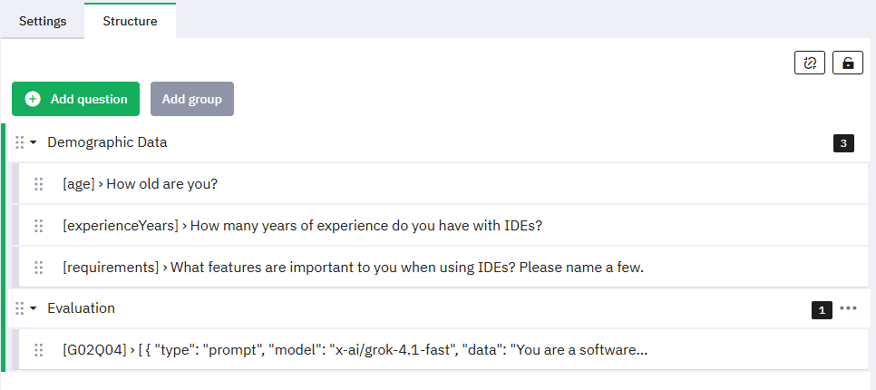
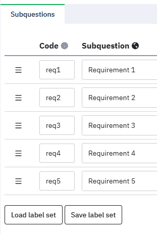
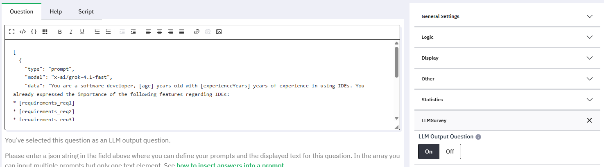
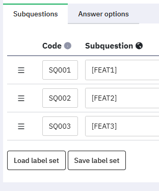
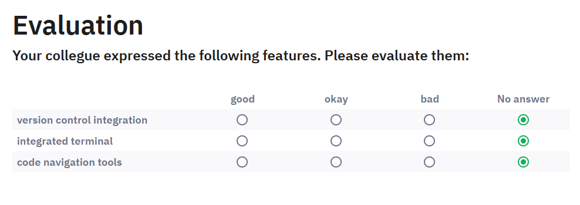

# Documentation

- [Introduction](#introduction)
- [Installation](#installation)
- [Usage](#usage)
- [Advanced Configuration](#advanced-configuration)
- [Example](#example)

## Introduction

LLMSurvey is a plugin for the survey platform LimeSurvey. It allows participants' answers to be dynamically inserted into a prompt for a Large Language Model (LLM) and displays the generated output directly in the survey for evaluation.

This project was developed as part of a thesis to simplify empirical research on the quality of personalized LLM output.

### Why this plugin?

The quality of LLM-generated texts is highly context-dependent and often requires human evaluation. Previously, empirically collecting feedback for personalized LLM output was cumbersome: researchers had to collect data in an initial survey, manually generate the output, and present it for evaluation in a separate survey.

This plugin integrates this entire workflow solves into a single survey run. It bridges the gap between data collection, dynamic generation of personalized LLM output, and immediate participant evaluation.

### Core Features

- **Dynamic Placeholders:** Use participant answers (e.g. `[age]`) directly in prompts.
- **Immediate Evaluation:** Display LLM output on a subsequent page for immediate user feedback.
- **Tracability:** Generated outputs are saved alongside survey data using automatically generated hidden questions.
- **Robust parsing:** Automatically extracts JSON objects from LLM responses.

## Installation

1. Create a new folder inside your LimeSurvey plugins directory:

   ```
   mkdir /LIMESURVEY_HOME_DIR/plugins/LLMSurvey
   ```

2. Paste all files from the `src/` folder into this new directory.
3. Go to the **Plugins** tab in LimeSurvey and activate **LLMSurvey**.

3. Find LLMSurvey in the plugins list of your LimeSurvey page and activate it.

## Usage

### 1. Plugin Settings

Before creating questions, configure the settings in the surveys plugin settings menu:

- **Activate for this Survey:** Toggle the plugin for this survey on/off. *Note: By activating, you confirm you are not unlawfully disclosing personal data to model operators.*
- **OpenRouter API Key:** The plugin uses [OpenRouter](https://openrouter.ai/) to handle requests. Enter your API key here.
- **Debug Mode:** Highly recommended during setup. This logs filled-in prompts, parsed LLM outputs, and errors to the browser console when conducting a survey.
- **System Prompt:** A survey-wide instruction sent with every prompt in the survey.
- **Custom Model API Keys** If you wish to use language models that are not supported through OpenRouter, enter the API keys for the models here.

### 2. Creating an LLM Question

1. **Create a Question Group:** Create a new question group *after* the questions you want to use as inputs.

2. **Create the Question:** Create a new question in this group.

3. **Enable LLM Mode:** In the right sidebar, find the category **LLMSurvey** and toggle it on.

4. **Define the Content:** In the **Question Text** field, you must provide a JSON array containing your Prompt(s) and the Display Text.


### 3. JSON Configuration Structure (for custom model see [Custom API](docs/custom-api.md))

The question text must be a valid JSON array. It typically contains one (or multiple) `prompt` objects and one `text` object.

```json
[
  {
    "type": "prompt",
    "model": "openai/gpt-4o",
    "temperature": 0.7,
    "data": "You are an assistant. The user is [age] years old. Generate a suggestion. Your output MUST be a valid json in the format {\"RESULT\": \"your text here\"}."
  },
  {
    "type": "text",
    "data": "Based on your profile, the AI suggests: [RESULT]"
  }
]
```

#### The Prompt Object

- `type`: Must be `"prompt"`.
- `model`: The model code from [OpenRouter Models](https://openrouter.ai/models).
- `data`: Your prompt. Use placeholders like `[question_code]` to insert previous answers. For more complex question types refer to [Prompt Codes](docs/prompt-codes.md).
- `temperature`: *(Optional)*: 0-2. Controls randomness.
- `maxTokens`: *(Optional)*: Limit output length.
- `topP`: *(Optional)*: 0-1. Controls randomness.
- `overrideSystemprompt`: *(Optional)*: Set to `true` to ignore the global system prompt for this specific prompt.
- **JSON Requirement & Field Naming:** You **must** explicitly tell the LLM to output JSON and which field names (keys) to use in its JSON output (e.g., `format {KEY: value}`).
  - These keys become the placeholders you will use to display the text.
  - If you want to display the output using the placeholder `[RESULT]`, your prompt must explicitly ask: *"Return a valid JSON object in the format {RESULT: your generated answer}."*
  - The plugin automatically handles conversational text (like "Here is your JSON: {...}"), but the keys inside the JSON must match your placeholders exactly.

#### The Text Object

- `type`: Must be `"text"`.
- `data`: The visible text displayed to the user. You can use the keys from the LLM's JSON output (e.g., `[RESULT]`) as placeholders here.

### 4. Activating the Survey

When you activate the survey, the plugin performs a check:

1. **Validation:** It ensures your JSON syntax is correct. If there is a syntax error, activation is blocked and an error message is displayed.
2. **Storage Generation:** The plugin automatically creates "Hidden" questions (e.g., `{questionCode}output0`) to store the parsed LLM outputs.
   - These appear in your question list but they are hidden from participants in the survey.
   - **Note:** If you change the order of your LLM questions, you may want to remove or manually move these hidden storage questions to keep your data fields organized, though the plugin works regardless their position.
   - If you deactivate and reactivate the survey, these questions are preserved (not duplicated).

## Advanced Configuration

### Multiple Prompts

You can define multiple `prompt` objects in the array and they are executed individually. This is useful for breaking down complex tasks or generating multiple distinct variations.

```json
[
  { "type": "prompt", "data": "Generate a pros list...", "model": "..." },
  { "type": "prompt", "data": "Generate a cons list...", "model": "..." },
  { "type": "text", "data": "Pros: [PROS] <br> Cons: [CONS]" }
]
```

### Using Output in Subquestions

Generated data isn't limited to the main questions text. You can use your placeholders (e.g., `[ITEM1]`) inside:
- **Subquestions:** (Arrays, Multiple Choice, ...)
- **Answer Options:** (Dropdowns, Ranking, ...)
- *Note: `Bootstrap Dropdown` answer options are not supported.*

### Languages

When creating a multilingual survey a question text for each language needs to be defined. For LLM questions the plugin uses the data array for the language a participant selected at the start of the survey.

## Example

Basic survey structure:<br>
<br>
A closer look into the `requirements` question:<br>
<br>
The LLM question `G02Q04`:<br>


With the question text:<br>
```json
[
  {
    "type": "prompt",
    "model": "x-ai/grok-4.1-fast",
    "data": "You are a software developer, [age] years old with [experienceYears] years of experience in using IDEs. You already expressed the importance of the following features regarding IDEs:
* [requirements_req1]
* [requirements_req2]
* [requirements_req3]
* [requirements_req4]
* [requirements_req5]
Please name 3 more, important features. Your output MUST be a valid json in the format {FEAT1: feature, FEAT2: feature, FEAT3: feature}.
"},
  {
    "type": "text",
    "data": "Your collegue expressed the following features. Please evaluate them:"
  }
]
```

The subquestions of the LLM question look like this:<br>


We can now run the survey as a test. With the provided example, the generated prompt looks like this:

```
You are a software developer, 25 years old with 7 years of experience in using IDEs. You already expressed the importance of the following features regarding IDEs:
* syntax highlighting
* intelligent code completions
* addons and plugins
* debugging tools
* refactoring methods
Please name 3 more, important features. Your output MUST be a valid json in the format {FEAT1: feature, FEAT2: feature, FEAT3: feature}.
```

The LLM returned:

```json
{
  "FEAT1": "version control integration",
  "FEAT2": "integrated terminal",
  "FEAT3": "code navigation tools"
}
```

Which is then inserted into the placeholders of the subquestions:<br>

